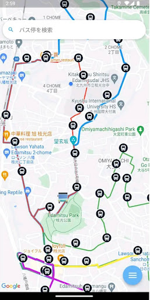
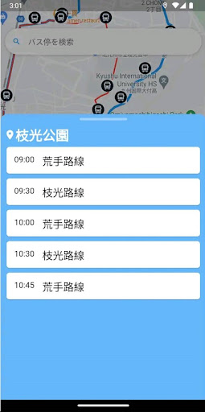

# どこバス

## アプリ紹介
  - バスの現在地をリアルタイムで確認できるアプリです。
  - 北九州市八幡東区枝光地区を対象としています。

  

## 今後の実装予定
  - バスの現在地をリアルタイムで取得し、アプリのマップ上に表示
    - バス一台ごとに GPS を発信できるデバイスを取り付け、そのデバイスからデータを取得する実装
  - バスが定刻より何分遅れているのかを表示
    - このアプリのコンセプトである、バスの現在地を取得する実装によって、バスの遅延をリアルタイムで確認する実装
  - 

## 目標
- このアプリの理想は、バス会社の協力があって成り立つものです。
- 本アプリは対象地区を絞っておりますが、いずれは全国のバスの現在地をリアルタイムで確認できるアプリにしたいと考えております。

# コミットメッセージの統一
- feat: 新しい機能
- fix: バグの修正
- docs: ドキュメントのみの変更
- refactor: 仕様に影響がないコード改善(リファクタ)
- perf: パフォーマンス向上関連
- test: テスト関連
- chore: ビルド、補助ツール、ライブラリ関連

# fvm の導入
 - flutter ver 3.10.6
 - dart ver 3.0.6

# 導入パッケージ
- dep
  - cloud_firestore: ^4.8.4
  - cupertino_icons: ^1.0.2
  - firebase_core: ^2.15.0
  - flutter:
    sdk: flutter
  - flutter_launcher_icons: ^0.13.1
  - flutter_native_splash: ^2.1.3+1
  - flutter_polyline_points: ^1.0.0
  - flutter_riverpod: ^2.3.6
  - freezed_annotation: ^2.4.1
  - geocoding: ^2.1.0
  - geolocator: ^9.0.2
  - google_maps_flutter: ^2.2.8
  - json_annotation: ^4.8.1
  - riverpod_annotation: ^2.1.2
  - timelines: ^0.1.0
  - url_launcher: ^6.0.9

- dev_dep
  - build_runner:
  - flutter_lints: ^2.0.0
  - freezed: ^2.4.2
  - json_serializable: ^6.7.1
  - pedantic_mono:
  - riverpod_generator:
